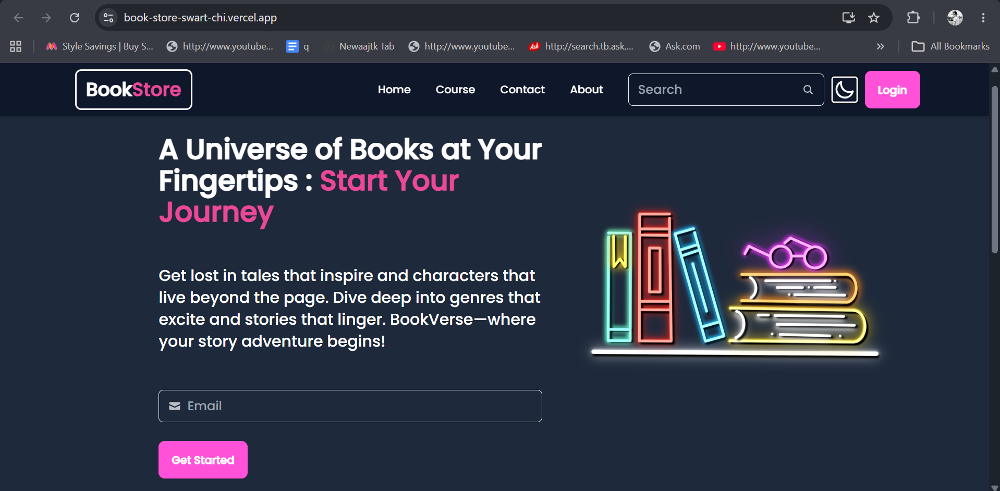
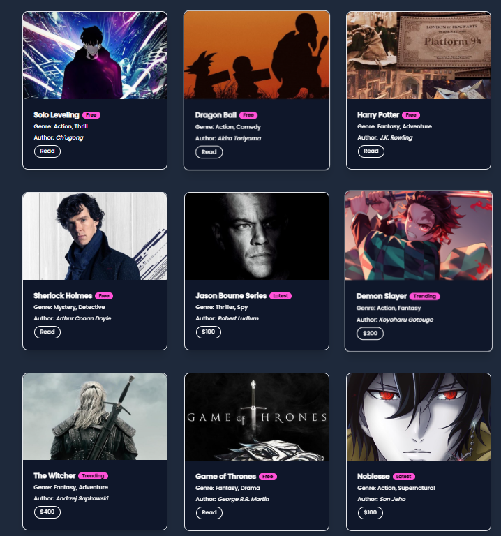
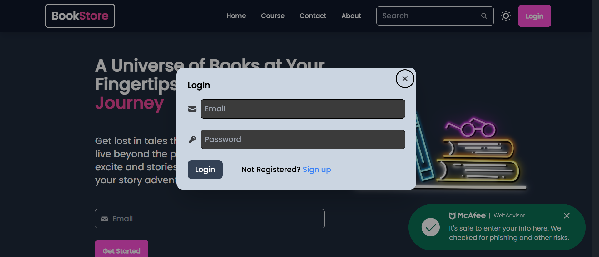
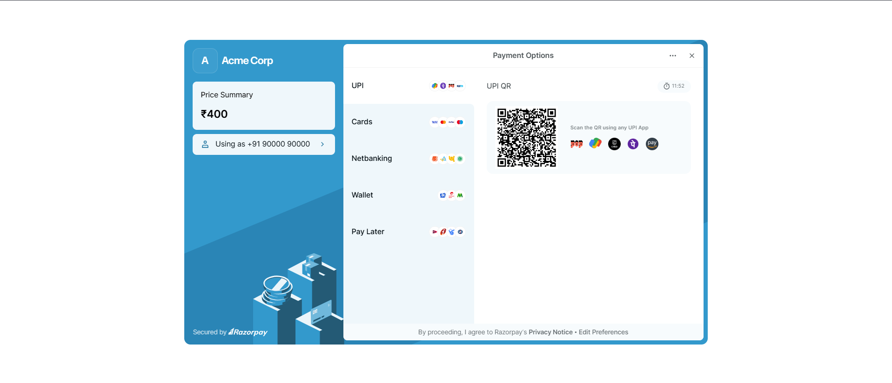
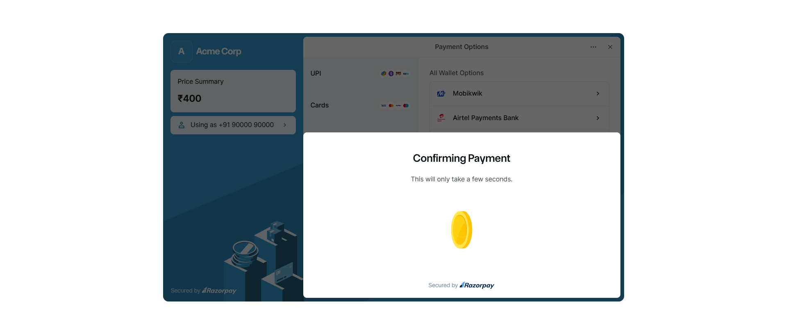
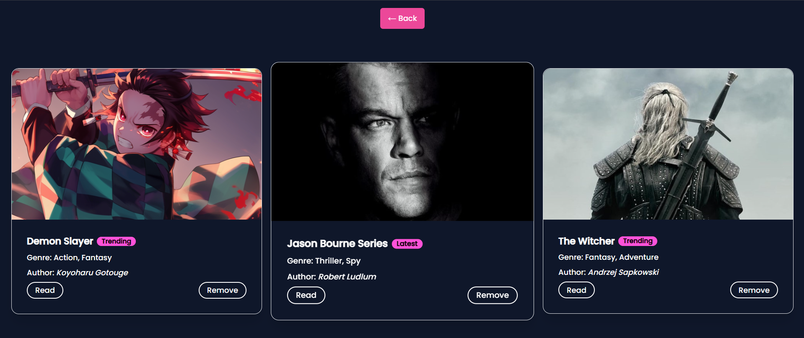

# 📚 BookStore – Full Stack MERN Application

A modern full-stack BookStore platform built using the MERN stack. The application enables users to browse books, create accounts, authenticate securely, purchase premium books, and access their purchased content through a responsive and intuitive user interface.

## 🚀 Live Demo

**Frontend:** https://book-store-swart-chi.vercel.app/

**Backend API:** https://book-store-lcz0.onrender.com

---

## ✨ Key Features

* 🔐 User Authentication (Signup/Login)
* 🛡️ Secure Password Hashing using Bcrypt
* 🎟️ JWT-based Authorization
* 📚 Browse Free and Premium Books
* 💳 Premium Book Purchase Flow
* 📖 Access Purchased Books
* 📱 Fully Responsive Design
* 🌐 RESTful API Architecture
* ☁️ Cloud Deployment with Vercel & Render

---

## 🛠️ Tech Stack

### Frontend

* React.js
* React Router DOM
* Axios
* Tailwind CSS
* DaisyUI

### Backend

* Node.js
* Express.js
* MongoDB
* Mongoose
* JWT Authentication
* Bcrypt.js

### Deployment

* Vercel (Frontend)
* Render (Backend)
* MongoDB Atlas (Database)

---

## 📂 Project Structure

```text
BOOKSTORE/
│
├── Final-Bookstore-frontend/
│   ├── public/
│   ├── src/
│   │   ├── Component/
│   │   ├── Context/
│   │   ├── Courses/
│   │   ├── Home/
│   │   └── image/
│   ├── package.json
│   └── tailwind.config.js
│
├── Final-Bookstore-backend/
│   ├── controller/
│   ├── middlewares/
│   ├── models/
│   ├── routes/
│   ├── utils/
│   ├── index.js
│   └── package.json
│
├── screenshots/
└── README.md
```

---

## ⚙️ Local Setup

### Clone Repository

```bash
git clone https://github.com/srijankishu/BOOK-STORE.git
cd BOOK-STORE
```

### Frontend Setup

```bash
cd Final-Bookstore-frontend
npm install
npm start
```

### Backend Setup

```bash
cd Final-Bookstore-backend
npm install
npm start
```

### Environment Variables

Create a `.env` file inside `Final-Bookstore-backend/`:

```env
PORT=4001

MONGODB_URI=your_mongodb_connection_string

JWT_SECRET=your_jwt_secret

CLOUDINARY_CLOUD_NAME=your_cloud_name
CLOUDINARY_API_KEY=your_api_key
CLOUDINARY_API_SECRET=your_api_secret
```

## 📸 Application Screenshots

### 🏠 Home Page



### 📚 Books Collection



### 🔐 Login Page



### 💳 Payment Page



### ✅ Payment Confirmation



### 📖 Purchased Books



---

## 🎯 Learning Outcomes

Through this project, I gained practical experience in:

* Full-Stack MERN Development
* REST API Design & Integration
* Authentication & Authorization
* Database Modeling with MongoDB
* Responsive UI Development
* Deployment & Production Hosting
* State Management in React

---

## 👨‍💻 Author

**Srijan Mishra**

B.Tech – Computer Science Engineering (2025)

GitHub: https://github.com/srijankishu

LinkedIn: Add Your LinkedIn Profile Here
